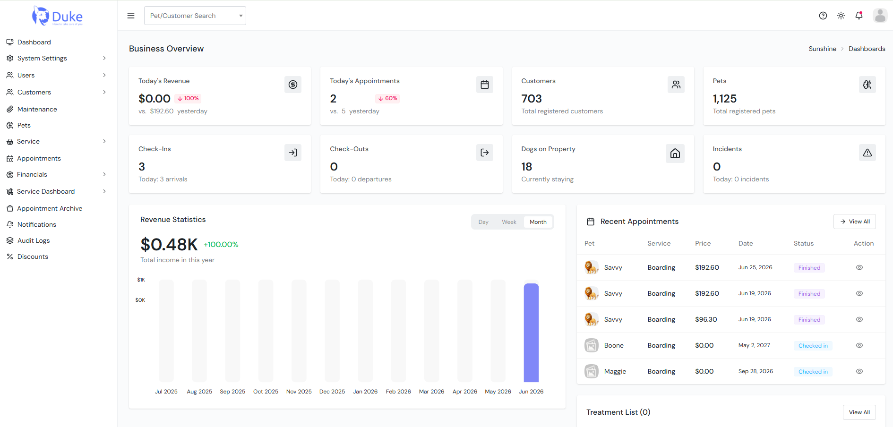
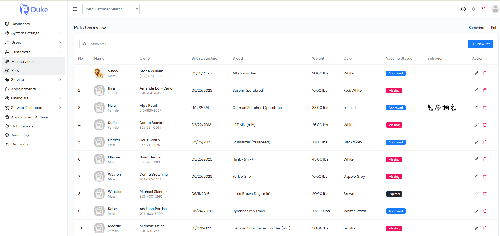

# Sunshine Pet Management System (Admin Portal)

A comprehensive pet care management platform built with **Laravel** for boarding facilities, daycare centers, grooming salons, and veterinary businesses. The system streamlines daily operations from appointment booking to payments and facility management.

## Features

* Boarding, Daycare & Grooming Appointments
* Customer & Pet Management
* Check-in / Check-out Workflow
* Kennel & Room Management
* Vaccination & Medical Records
* Invoice & Stripe Payment Integration
* Financial Dashboard & Payouts
* Calendar & Scheduling
* Reports & Notifications

## Tech Stack

* Laravel
* MySQL
* Bootstrap
* jQuery
* Stripe API
* REST API

## Screenshots

### Dashboard

<p align="center">

</p>

### Pet Management

<p align="center">

</p>

## Installation

```bash
git clone https://github.com/techsavvy87/sunshine-admin.git

composer install

cp .env.example .env

php artisan key:generate

php artisan migrate

php artisan serve
```

## License

This project is for portfolio and demonstration purposes.
